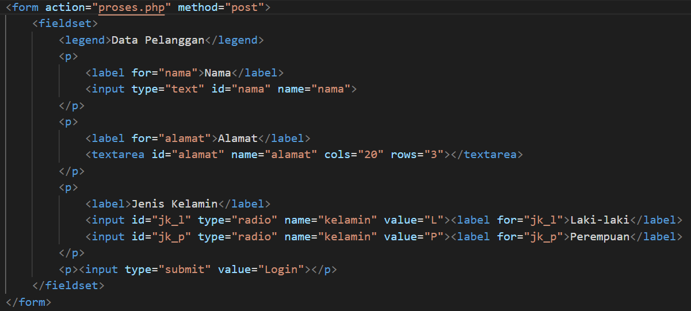

# Langkah - langkah Praktikum

### 1. Membuat ordered list

### 2. Membuat Unordered list

### 3. Membuat Description list

### 4. Membuat tabel

### 5. Mengatur margin dan padding

### 6. Menggabungkan sel data

### 7. Membuat form

### 8. Menambahkan style pada form

# Pertanyaan dan Tugas
1. Buatlah form yang menampilkan dropdown menu dan listbox dengan multiple selection.
